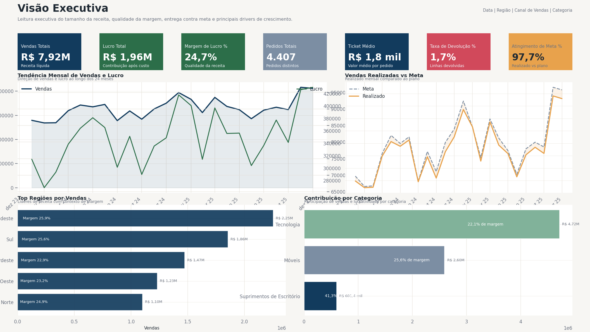
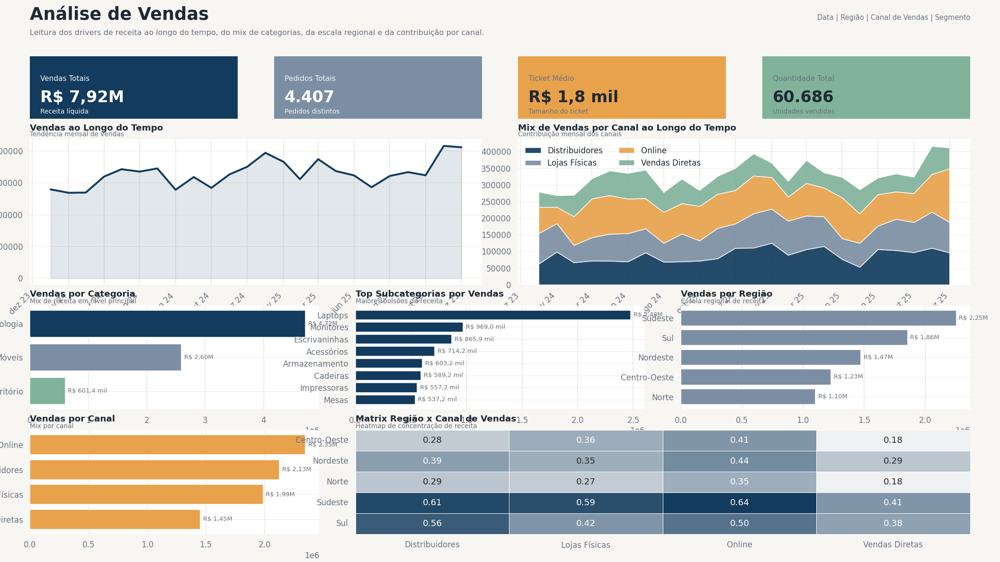
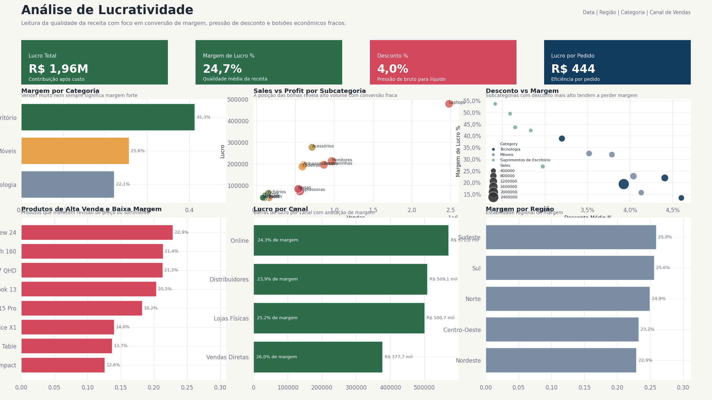
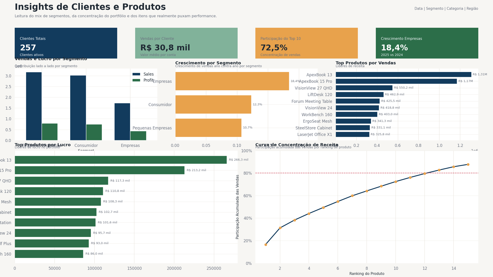
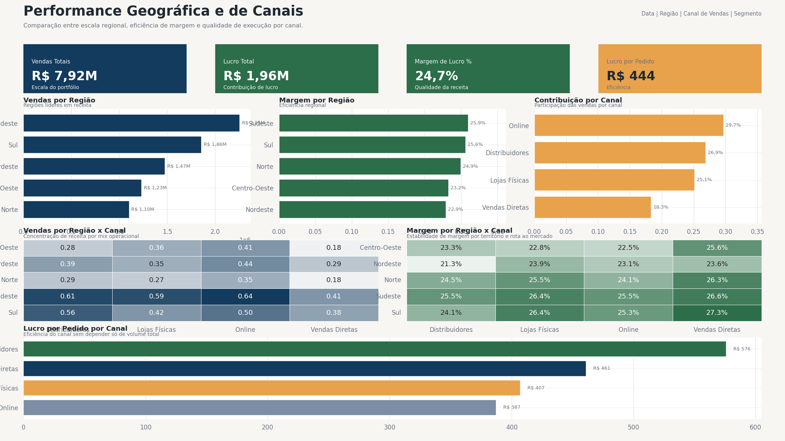
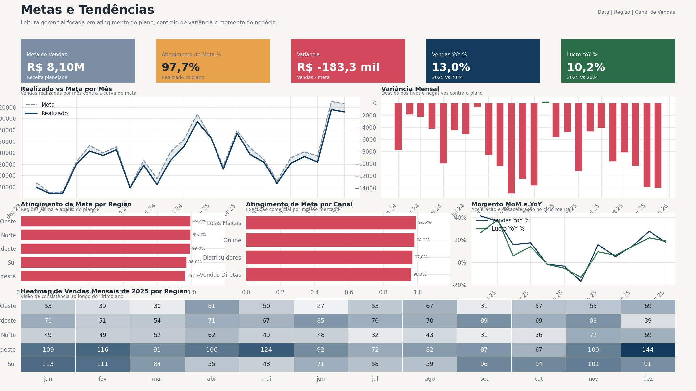

# Análise de Performance Comercial | Power BI + DAX + Power Query

Um projeto completo de portfólio em Power BI construído como um case realista de analytics comercial. O projeto combina geração reproduzível de dados sintéticos, modelagem dimensional, uma biblioteca estruturada de DAX e um blueprint de dashboard pensado para tomada de decisão executiva.

## Visão Geral

Este case simula uma empresa nacional com operação no Brasil em canais B2B e B2C. O negócio precisa monitorar receita, lucratividade, descontos, metas, execução regional e mix de produtos sem depender de planilhas desconectadas.

O repositório foi estruturado para ser forte mesmo fora do Power BI Desktop: a pipeline de dados é reproduzível, o modelo semântico está documentado e a lógica do dashboard está completamente especificada para análise no GitHub.

## Problema de Negócio

A liderança precisa responder perguntas como:

- Quais regiões e canais estão puxando crescimento com qualidade?
- Os descontos estão acelerando vendas saudáveis ou corroendo margem?
- Quais produtos geram volume de receita, mas destroem lucratividade?
- As metas mensais estão sendo batidas com consistência?
- Onde os times comerciais devem focar para melhorar eficiência?

O conjunto completo de perguntas está em [docs/business-questions.md](docs/business-questions.md).

## Objetivos

- Construir um dataset de analytics comercial com lógica reproduzível e realista
- Modelar vendas e metas em um star schema limpo
- Criar uma camada DAX útil para leitura executiva e análise diagnóstica
- Definir um dashboard profissional com múltiplas páginas
- Empacotar o projeto para GitHub, entrevistas e portfólio

## Frentes Analíticas

- Performance de receita
- Qualidade da margem e lucratividade
- Pressão de desconto
- Atingimento de metas
- Performance regional e por canal
- Mix de produtos e clientes
- Tendências mensais, MoM e YoY

## Dataset

O dataset é sintético, mas estruturado com comportamento comercial plausível.

### Resumo

| Métrica | Valor |
| --- | --- |
| Período | 2024-01-01 a 2025-12-31 |
| Linhas de vendas | 9.586 |
| Pedidos | 4.407 |
| Clientes | 257 |
| Produtos | 28 |
| Regiões | 5 |
| Canais | 4 |
| Linhas de metas mensais | 480 |

### Escala do Negócio

| KPI | Valor |
| --- | --- |
| Receita Total | 7,92M |
| Lucro Total | 1,96M |
| Margem de Lucro % | 24,74% |
| Ticket Médio | 1.796,12 |
| Desconto Médio % | 4,00% |
| Taxa de Devolução % | 1,74% |
| Atingimento Médio da Meta % | 98,18% |

Os detalhes de geração estão documentados em [docs/data-generation-logic.md](docs/data-generation-logic.md).

## Modelo de Dados

O modelo usa duas tabelas fato:

- `fact_sales` no grão de linha de pedido
- `fact_targets` no grão mês x região x canal

Suportadas pelas dimensões:

- `dim_date`
- `dim_product`
- `dim_customer`
- `dim_geography`
- `dim_region`
- `dim_channel`
- `dim_sales_rep`

Por que essa estrutura:

- separa corretamente dados transacionais e dados de planejamento
- suporta análise de variância sem duplicação
- facilita a escalabilidade e a explicação das medidas DAX

Veja [docs/data-model.md](docs/data-model.md) e [docs/modeling-rationale.md](docs/modeling-rationale.md).

## KPIs

A camada DAX cobre métricas centrais, lucratividade, inteligência temporal, metas e ranking.

Medidas representativas:

- Total Sales
- Total Profit
- Total Cost
- Average Order Value
- Profit Margin %
- Discount %
- Return Rate %
- Sales PY
- Sales YoY %
- Profit YoY %
- Running Sales
- Sales Target
- Target Attainment %
- Sales vs Target Variance
- Rank Region by Sales
- Rank Category by Profit

A biblioteca completa está em [docs/dax-measures.md](docs/dax-measures.md).

## Páginas do Dashboard

| Página | Propósito |
| --- | --- |
| Visão Executiva | Resumo executivo com receita, lucro, margem, metas e principais drivers |
| Análise de Vendas | Tendências de receita, drivers de produto e contribuição por canal |
| Análise de Lucratividade | Qualidade da margem, impacto de desconto e áreas com economia fraca |
| Insights de Clientes e Produtos | Crescimento por segmento, concentração e produtos principais |
| Performance Geográfica e de Canais | Comparação regional e eficiência cruzada por canal |
| Metas e Tendências | Realizado vs meta, variância, MoM e YoY |
| Metodologia | Página opcional para contexto de negócio, modelo e definições de KPI |

Veja [docs/dashboard-blueprint.md](docs/dashboard-blueprint.md), [docs/page-by-page-kpi-map.md](docs/page-by-page-kpi-map.md) e [docs/design-decisions.md](docs/design-decisions.md).

## Principais Insights

- As vendas cresceram 12,99% em 2025, mas o lucro cresceu apenas 10,20%, reduzindo a margem de 25,07% para 24,45%.
- O Sudeste é o maior mercado em receita, mas fica abaixo de outras regiões em atingimento de meta e apresenta maior desconto médio.
- Tecnologia é o principal motor de vendas, mas algumas linhas de alto volume, como impressoras e mesas, convertem mal em lucro.
- Direct Sales gera menos volume do que Online, mas entrega margem superior e lucro por pedido mais forte.
- Enterprise é o segmento com crescimento mais acelerado, sugerindo oportunidade em contas de maior valor.
- Os 10 principais produtos representam 72,48% da receita total, criando uma concentração relevante do portfólio.

Os insights completos estão em [docs/final-insights.md](docs/final-insights.md).

## Recomendações

- Revisar a política de descontos em impressoras, mesas e algumas linhas de laptops
- Proteger e escalar a economia do canal Direct Sales
- Recalibrar a execução comercial no Sudeste para melhorar o atingimento de metas
- Acelerar o crescimento em Enterprise onde ticket e mix são mais saudáveis
- Monitorar devoluções no canal Online em períodos promocionais

## Estrutura do Projeto

```text
powerbi-sales-performance-analytics/
|- assets/
|  |- theme/
|- data/
|  |- raw/
|  |- processed/
|- docs/
|- powerbi/
|- screenshots/
|- scripts/
|- .gitignore
|- LICENSE
|- README.md
|- requirements.txt
```

## Como Reproduzir

### Regerar os Dados

```bash
pip install -r requirements.txt
python scripts/run_full_build.py
```

### Montar o Relatório

1. Importe os CSVs de `data/processed/` no Power BI Desktop.
2. Crie os relacionamentos descritos em [docs/data-model.md](docs/data-model.md).
3. Marque `dim_date[Date]` como tabela oficial de datas.
4. Crie as medidas de [docs/dax-measures.md](docs/dax-measures.md).
5. Importe o tema de `assets/theme/sales-performance-theme.json`.
6. Monte as páginas seguindo [docs/dashboard-blueprint.md](docs/dashboard-blueprint.md).

O passo a passo completo está em [docs/reproduction-guide.md](docs/reproduction-guide.md).

### Gerar os Previews do Portfólio

```bash
python scripts/generate_dashboard_previews.py
```

Para o handoff final de Power BI Desktop, use [powerbi/final-dashboard-handoff.md](powerbi/final-dashboard-handoff.md).

## Prévia do Dashboard

O repositório já inclui seis renders de preview alinhados ao blueprint final das páginas. Eles podem ser substituídos depois, um a um, por exports nativos do Power BI Desktop com os mesmos nomes.

| Visão Executiva | Análise de Vendas |
| --- | --- |
|  |  |

| Análise de Lucratividade | Insights de Clientes e Produtos |
| --- | --- |
|  |  |

| Performance Geográfica e de Canais | Metas e Tendências |
| --- | --- |
|  |  |

Veja [screenshots/README.md](screenshots/README.md) para o fluxo de exportação e substituição.

## Competências Demonstradas

- Estruturação de projeto em Power BI
- Geração de dados sintéticos com lógica de negócio
- Modelagem dimensional
- Design de medidas DAX
- Planejamento de Power Query
- Arquitetura de dashboard executivo
- Documentação para GitHub e entrevistas
- Storytelling de negócio e recomendações analíticas

## Próximas Evoluções

- Adicionar um artefato PBIP completo
- Substituir os previews por exports nativos do Power BI Desktop
- Incluir cenários de forecast e budget
- Adicionar drillthrough e tooltips
- Incluir retenção de clientes e recompra
- Expandir análise de metas por representante comercial
